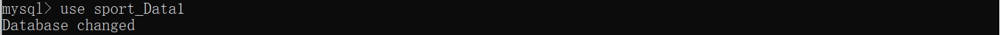
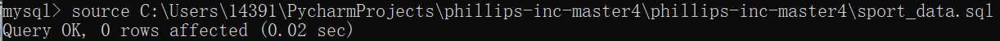
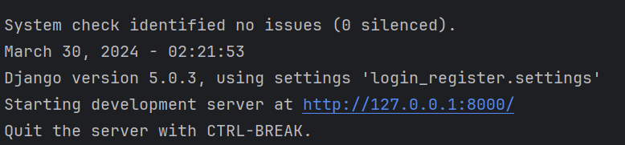
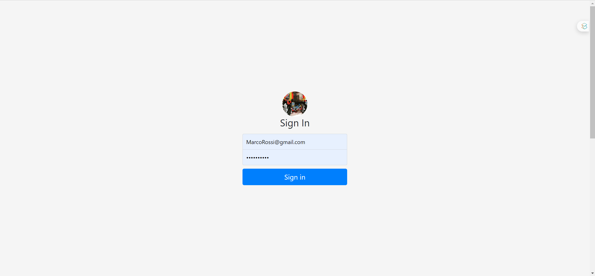
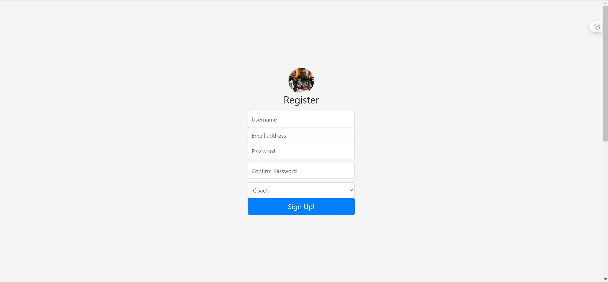
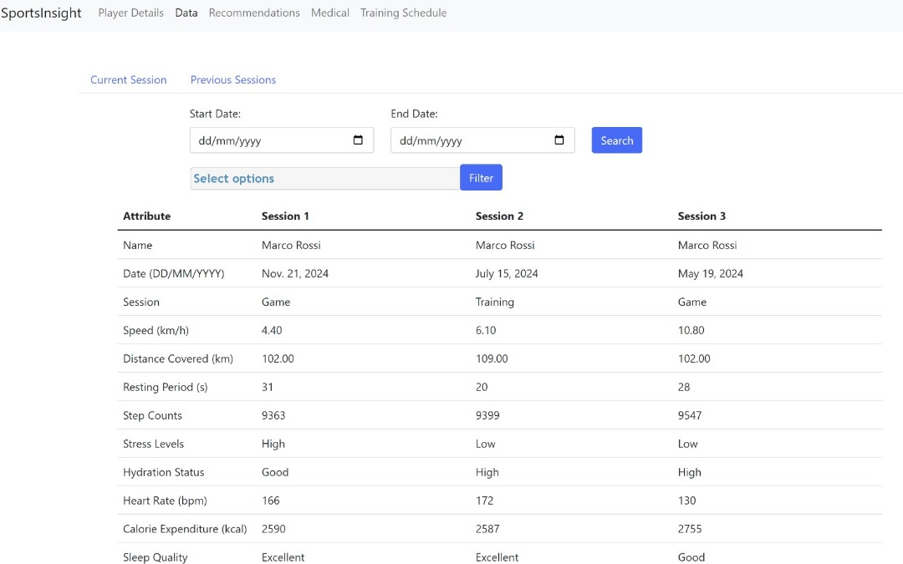
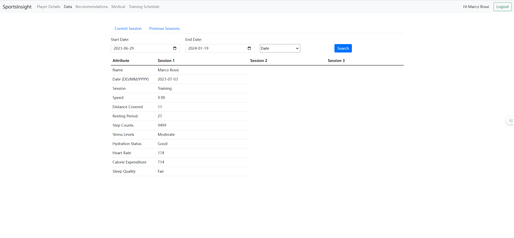
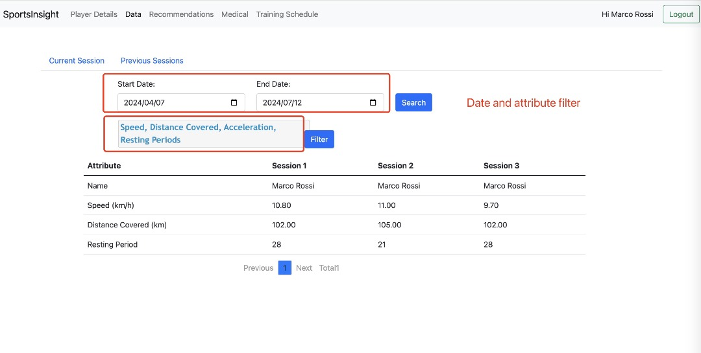
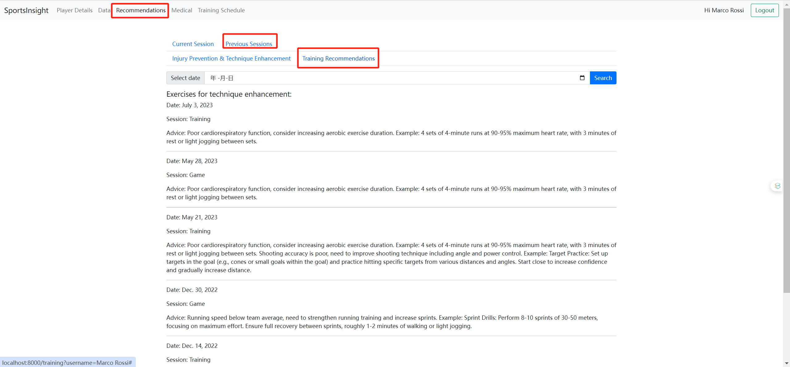
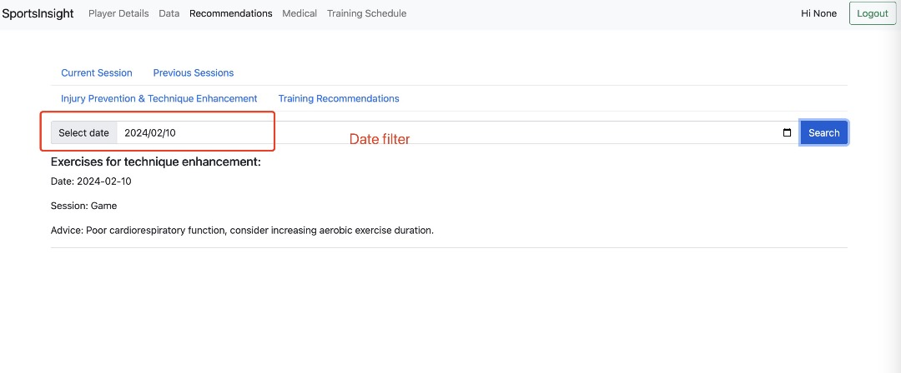

# Sports Insight --Sports Performance Analysis and Recommendation System

‘Sports Insight’ is a Sports Performance Analysis and Recommendation System developed by our team ‘Phillips-Inc’ to provide an all-encompassing solution tailored to elevate player performance, refine technique, and minimize injury risks across various sports, initially focusing on football and subsequently adaptable to other athletic activities. 

## Prerequisites:
* [Python](https://www.python.org/) Installed (version 3.8.9)
* [Django](https://www.djangoproject.com/) installed. (version 3.1.2)
* MySQL version higher than 8.0.0
* pandas
* numpy

* A Terminal.

You can install all the tools required in our Django project with:
```bash
pip install -r requirements.txt
```

Code file function outline

-  test/management/commands/test_data_generate.py

  - Used for generating datasets required for testing. If more tests need to be generated, parameters can be manually modified.

- test/management/commands/import_csv_to_mysql.py

  - Used to import the generated data into the created MySQL database.

- test/management/commands/analyze_performance.py

  - Core analysis code of the program, containing analysis of performance data in the database (this function will analyze the heart rate, speed, and shot accuracy of a specific player's last three matches) and provide training suggestions 

- test/tests.py

  - It is used to check whether the analyzer can recognize outliers and null values to ensure correct result output.

- test/test_database.py

  - Used to check whether the database is successfully connected

  

## Running The Server On Localhost

First you need to have a code compiler or integrated development environment, such as PyCharm or VS Code

(optional - might work without it) In your PyCharm/VS Code Terminal / Command Prompt, type the following:

```bash
#enter the virtual environment
myenv\Scripts\activate
```

#### Set up your MySQL database

1. Enter MySQL 8.0 command line client by typing  below command and pressing Enter. Replace `username` with your MySQL username, logging in with your password

   ```
   mysql -u username -p
   ```

2. After logging in with your password, create your own database

   ```
   create database sport_Data1;
   ```

3. Select the database where you want to execute the SQL file by typing the command below and pressing Enter. 

   ```
   use sport_Data1
   ```

    

   

4. **Importing Database Structure and Data:** Execute the SQL file by typing  below command and pressing Enter. Replace `/absolutepath/sport_data1.sql` with the actual path to your SQL file. This command will execute the SQL statements in the specified file within the MySQL environment.  If the following information is displayed, the database has been successfully imported

   ```
   source /your_absolute_path/sport_data1.sql
   ```

   

5. You can test whether the database connection is successful by executing in PyCharm's terminal interface(option)

6. Go to the combine/settings.py file and edit USER and PASSWORD with your own MySQL information. It's assumed that you already have a username setup in MySQL.

```
DATABASES = {
    'default': {
        'ENGINE': 'django.db.backends.mysql',
        'NAME': 'sport_Data1',
        'HOST':'localhost',
        'PORT':'3306',
        'USER':'root',
        'PASSWORD':'your MYSQL password',
        'CHARSET':'utf8'
    }
}
```

7. In your PyCharm/VS Code terminal

```bash
#run the service
python manage.py runserver
```


You would see some logs now. Ignore them. All you have to do is visit [`localhost:8000`](http://localhost:8000/register) on your browser. To stop the server, return to your terminal and press `CTRL-C`.

## Logging In

Visit the [login page](http://localhost:8000/login/) and try to login! The preloaded user's email is `Marco_Rossi@gmail.com` and the password is `MarcoRossi` to enter a player interface. Or the other player like LucaBianchi@gmail.com and password:LucaBianchi. You can view this in [user_data.json](https://github.com/vismodo/django-login-and-register/blob/master/user_data.json). If you enter incorrect details, you will see a Bootstrap Alert. 

To register with an account, visit the [registration page](http://localhost:8000/login/register).(http://localhost:8000/login/register)




## The player session data page

On this page, you will find the current logged-in player: Marco Rossi's season performance and his physical status records. The "previous session" section provides a parallel display of the performance in the last three matches, offering data for coaches to compare.



You can filter the data by date and attribute, selecting the specific time frame you wish to examine, ensuring a thorough data retrospective.





## The player recommendation page

#### The training recommendations page:

On this interface, you can observe performance and health data tailored to the current athlete. The software's analytical system provides automated training recommendations, offering coaches valuable insights for crafting effective training plans.



You also can change  the date use the date filter.


